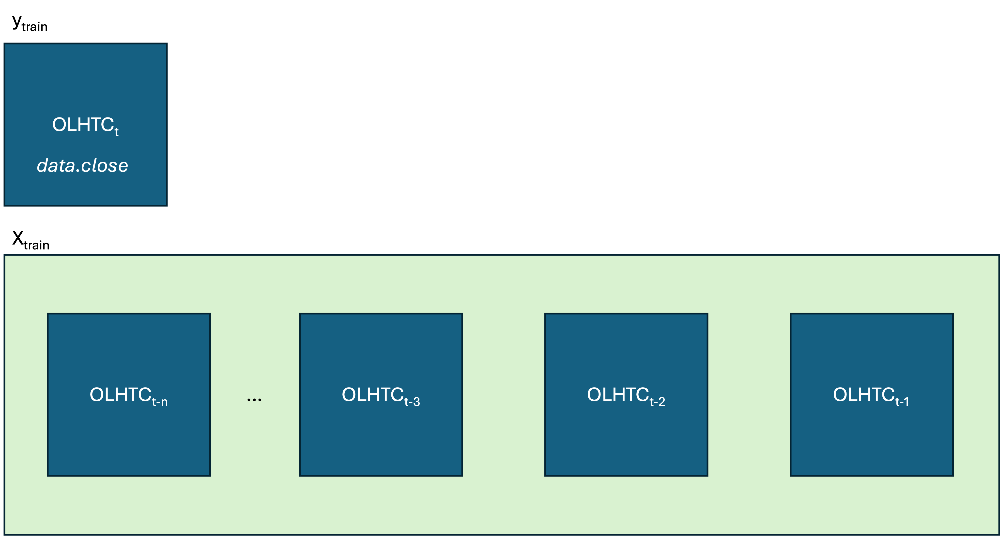

# Stock-App #

This project demonstrates a scalable architecture for real-time stock data processing and prediction using Apache Kafka. We leverage the Alpha Vantage API to stream 5-minute intra-day stock price data into a Kafka pub/sub framework, enabling decoupled and scalable data ingestion and processing.

A lagged linear regression model, built with scikit-learn, is applied to perform short-term stock price prediction based on historical patterns. The project showcases data visualization, feature engineering using lagged variables, and the potential of Kafka for real-time analytics pipelines.

## model ##

We are pulling data from the Alpha Vantage API: https://www.alphavantage.co/documentation/, from a 5 minute time-series intra-day ticker, and using a pub/sub framework to test the use of kafka to enable scalability.

Stock prediction and plotting using lagged linear regression model with scikit-learn.



## apache kafka ##

Follow official apache website instructions to download Kafka on the host, and run

```
chmod +x init_kafka.sh
./init_kafka.sh
```

This will initialize a Kafka server with Zookeeper on localhost:9020, and creates (for now) a single topic named stock-events. 

## next steps ##

1. Specify a performance metric for time series (accuracy, what else?)

2. Test performance of other models on various stocks or aggregation of stocks - XGBoost and Online LSTM

3. Apache airflow orchestration of model fitting Full Extraction, Transformation, Load (ETL) pipeline ###

The next step in the data pipeline is to use apache airflow to refresh our database and refit the model after a certain amount of new datapoints are available.
The ETL data pipeline also provides the option to scale and manage our application across a distributed system.


